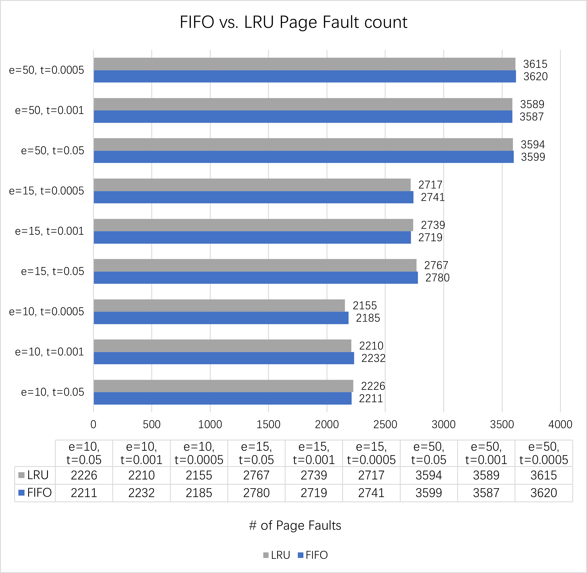

## Project Structure
```
+-[output]        ; Sample output files
|-RS_Generator.py ; Generate RS file with the gen_rs() function
|-RS_Reader.py    ; Provide a read_rs_from_file() function to read RS files
|-FIFO.py         ; Implementation of FIFO algorithm
|-LRU.py          ; Implementation of LRU algorithm
|-test.py         ; Generate multiple RS files and test each algorithm
|-...
```

## Sample output of test.py
- A sample ouput when P=2^20, s=0, m=200, and RS_length = 20:

  - (The final length of each RS is 20 * 200 = 4000)
  - This is also in `output/output.txt`
  - Generated RS files are in `output/`

```
FIFO page fault count when e=10, t=0.05: 2211
LRU page fault count when e=10, t=0.05: 2226
FIFO page fault count when e=10, t=0.001: 2232
LRU page fault count when e=10, t=0.001: 2210
FIFO page fault count when e=10, t=0.0005: 2185
LRU page fault count when e=10, t=0.0005: 2155
FIFO page fault count when e=15, t=0.05: 2780
LRU page fault count when e=15, t=0.05: 2767
FIFO page fault count when e=15, t=0.001: 2719
LRU page fault count when e=15, t=0.001: 2739
FIFO page fault count when e=15, t=0.0005: 2741
LRU page fault count when e=15, t=0.0005: 2717
FIFO page fault count when e=50, t=0.05: 3599
LRU page fault count when e=50, t=0.05: 3594
FIFO page fault count when e=50, t=0.001: 3587
LRU page fault count when e=50, t=0.001: 3589
FIFO page fault count when e=50, t=0.0005: 3620
LRU page fault count when e=50, t=0.0005: 3615
```

- (This is the data we use for the report in the next section)

## Report



- Both page replacement algorithms, FIFO and LRU, has similar number of page faults, but overall, LRU performs slightly better.